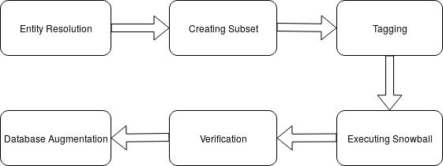

# snowball-relationship-extraction

 </img> 

1. **Entity Resolution** - The most challenging and important step in explicit link extraction is of resolving the entities from mass media articles with the entities present in Neo4j graph database for which sophisticated ER algorithms have been used. 
1. **Creating Subset** - The mongoDb database contains around 4.9 million articles crawled from various news portals. With an aim to extract *located in* and *works in* relations from an article having ORGANIZATION as one of the entities we created a subset of articles mentioning at least one organization which is featured in our neo4j graph database. It significantly reduced the number of articles to around 50,000.
1. **Tagging** - The subset of articles are now tagged using the output of open-calais which provides the type, location, prefix, suffix etc of the entities present in the article.
1. **Snowball Execution** - After tagging, we created positive and negative seed sets for extracting works in and located in relations which were fed to the snowball classifier along with the set of tagged articles and other params. The output file contained the name of related entities along with the confidence.
1. **Verification** - These relations extracted from mass media articles are termed as explicit relations. We verified the extracted relations by reading the articles, the correct relations were pushed to the graph database thereby enriching the existing database.
1. **Database Augmentation** - Database is augmented with new links extracted from news articles.    
